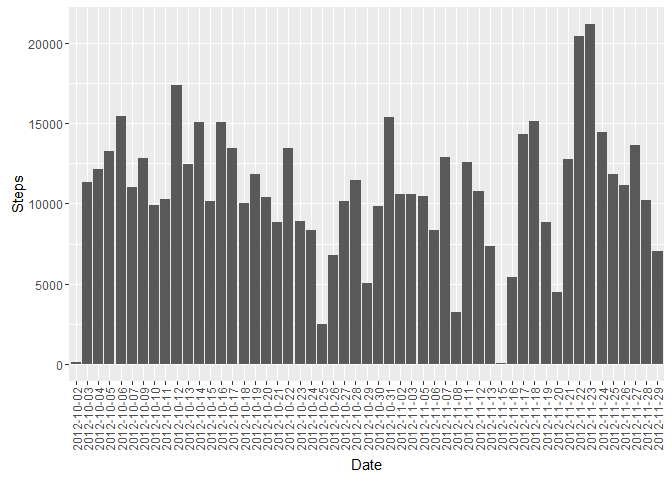
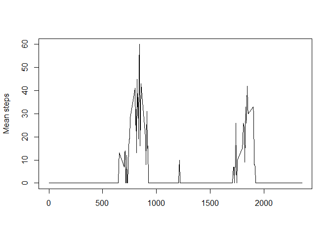
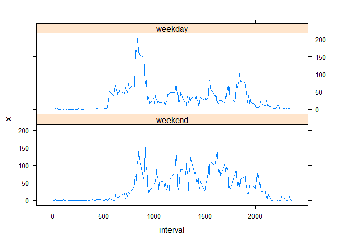

#PA1_template.Rmd
##mbieganski
##27 marca 2016

1. Code for reading in the dataset and/or processing the data


```r
nadf <- read.csv("activity.csv")
df <- nadf[complete.cases(nadf$steps),]
```

2. Histogram of the total number of steps taken each day


```r
library(ggplot2)

sumdf <- aggregate(df$steps, by=list(date=df$date), FUN=sum)
meandf <- aggregate(df$steps, by=list(date=df$date), FUN=mean)
mediandf <- aggregate(df$steps, by=list(date=df$date), FUN=median)

names(meandf) <- c("day", "mean")
names(mediandf) <- c("day", "median")

ggplot(sumdf, aes(x=date, y=x)) + geom_bar(stat="identity") + ylab("Steps") + xlab("Date") + theme(axis.text.x = element_text(angle = 90, vjust = 0.5, hjust=1))
```



3. Mean and median number of steps taken each day

Mean

```r
meandf
```

```
##           day       mean
## 1  2012-10-02  0.4375000
## 2  2012-10-03 39.4166667
## 3  2012-10-04 42.0694444
## 4  2012-10-05 46.1597222
## 5  2012-10-06 53.5416667
## 6  2012-10-07 38.2465278
## 7  2012-10-09 44.4826389
## 8  2012-10-10 34.3750000
## 9  2012-10-11 35.7777778
## 10 2012-10-12 60.3541667
## 11 2012-10-13 43.1458333
## 12 2012-10-14 52.4236111
## 13 2012-10-15 35.2048611
## 14 2012-10-16 52.3750000
## 15 2012-10-17 46.7083333
## 16 2012-10-18 34.9166667
## 17 2012-10-19 41.0729167
## 18 2012-10-20 36.0937500
## 19 2012-10-21 30.6284722
## 20 2012-10-22 46.7361111
## 21 2012-10-23 30.9652778
## 22 2012-10-24 29.0104167
## 23 2012-10-25  8.6527778
## 24 2012-10-26 23.5347222
## 25 2012-10-27 35.1354167
## 26 2012-10-28 39.7847222
## 27 2012-10-29 17.4236111
## 28 2012-10-30 34.0937500
## 29 2012-10-31 53.5208333
## 30 2012-11-02 36.8055556
## 31 2012-11-03 36.7048611
## 32 2012-11-05 36.2465278
## 33 2012-11-06 28.9375000
## 34 2012-11-07 44.7326389
## 35 2012-11-08 11.1770833
## 36 2012-11-11 43.7777778
## 37 2012-11-12 37.3784722
## 38 2012-11-13 25.4722222
## 39 2012-11-15  0.1423611
## 40 2012-11-16 18.8923611
## 41 2012-11-17 49.7881944
## 42 2012-11-18 52.4652778
## 43 2012-11-19 30.6979167
## 44 2012-11-20 15.5277778
## 45 2012-11-21 44.3993056
## 46 2012-11-22 70.9270833
## 47 2012-11-23 73.5902778
## 48 2012-11-24 50.2708333
## 49 2012-11-25 41.0902778
## 50 2012-11-26 38.7569444
## 51 2012-11-27 47.3819444
## 52 2012-11-28 35.3576389
## 53 2012-11-29 24.4687500
```

Median

```r
mediandf
```

```
##           day median
## 1  2012-10-02      0
## 2  2012-10-03      0
## 3  2012-10-04      0
## 4  2012-10-05      0
## 5  2012-10-06      0
## 6  2012-10-07      0
## 7  2012-10-09      0
## 8  2012-10-10      0
## 9  2012-10-11      0
## 10 2012-10-12      0
## 11 2012-10-13      0
## 12 2012-10-14      0
## 13 2012-10-15      0
## 14 2012-10-16      0
## 15 2012-10-17      0
## 16 2012-10-18      0
## 17 2012-10-19      0
## 18 2012-10-20      0
## 19 2012-10-21      0
## 20 2012-10-22      0
## 21 2012-10-23      0
## 22 2012-10-24      0
## 23 2012-10-25      0
## 24 2012-10-26      0
## 25 2012-10-27      0
## 26 2012-10-28      0
## 27 2012-10-29      0
## 28 2012-10-30      0
## 29 2012-10-31      0
## 30 2012-11-02      0
## 31 2012-11-03      0
## 32 2012-11-05      0
## 33 2012-11-06      0
## 34 2012-11-07      0
## 35 2012-11-08      0
## 36 2012-11-11      0
## 37 2012-11-12      0
## 38 2012-11-13      0
## 39 2012-11-15      0
## 40 2012-11-16      0
## 41 2012-11-17      0
## 42 2012-11-18      0
## 43 2012-11-19      0
## 44 2012-11-20      0
## 45 2012-11-21      0
## 46 2012-11-22      0
## 47 2012-11-23      0
## 48 2012-11-24      0
## 49 2012-11-25      0
## 50 2012-11-26      0
## 51 2012-11-27      0
## 52 2012-11-28      0
## 53 2012-11-29      0
```

4. Time series plot of the average number of steps taken


```r
medianIntervalDF <- aggregate(df$steps, by=list(interval=df$interval), FUN=median)
plot(medianIntervalDF$interval, medianIntervalDF$x, type = "l", ylab = "Mean steps", xlab = "")
```



5. The 5-minute interval that, on average, contains the maximum number of steps


```r
max(medianIntervalDF$x)
```

```
## [1] 60
```

```r
subset(medianIntervalDF, x == max(medianIntervalDF$x), select = interval)
```

```
##     interval
## 106      845
```

6. Code to describe and show a strategy for imputing missing data


```r
datasetSummary <- summary(nadf)
datasetSummary[7,1]
```

```
## [1] "NA's   :2304  "
```


```r
meanIntervalDF <- aggregate(df$steps, by=list(interval=df$interval), FUN=mean)
df <- merge(x = nadf, y = meanIntervalDF, by = "interval", all = TRUE)
df$steps[is.na(df$steps)] <- df$x
```

7. Histogram of the total number of steps taken each day after missing values are imputed


```r
sumdf <- aggregate(df$steps, by=list(date=df$date), FUN=sum)
meandf <- aggregate(df$steps, by=list(date=df$date), FUN=mean)
mediandf <- aggregate(df$steps, by=list(date=df$date), FUN=median)

names(meandf) <- c("day", "mean")
names(mediandf) <- c("day", "median")
```

Mean

```r
meandf
```

```
##           day       mean
## 1  2012-10-01  0.4476546
## 2  2012-10-02  0.4375000
## 3  2012-10-03 39.4166667
## 4  2012-10-04 42.0694444
## 5  2012-10-05 46.1597222
## 6  2012-10-06 53.5416667
## 7  2012-10-07 38.2465278
## 8  2012-10-08  0.4471960
## 9  2012-10-09 44.4826389
## 10 2012-10-10 34.3750000
## 11 2012-10-11 35.7777778
## 12 2012-10-12 60.3541667
## 13 2012-10-13 43.1458333
## 14 2012-10-14 52.4236111
## 15 2012-10-15 35.2048611
## 16 2012-10-16 52.3750000
## 17 2012-10-17 46.7083333
## 18 2012-10-18 34.9166667
## 19 2012-10-19 41.0729167
## 20 2012-10-20 36.0937500
## 21 2012-10-21 30.6284722
## 22 2012-10-22 46.7361111
## 23 2012-10-23 30.9652778
## 24 2012-10-24 29.0104167
## 25 2012-10-25  8.6527778
## 26 2012-10-26 23.5347222
## 27 2012-10-27 35.1354167
## 28 2012-10-28 39.7847222
## 29 2012-10-29 17.4236111
## 30 2012-10-30 34.0937500
## 31 2012-10-31 53.5208333
## 32 2012-11-01  0.4488339
## 33 2012-11-02 36.8055556
## 34 2012-11-03 36.7048611
## 35 2012-11-04  0.4494235
## 36 2012-11-05 36.2465278
## 37 2012-11-06 28.9375000
## 38 2012-11-07 44.7326389
## 39 2012-11-08 11.1770833
## 40 2012-11-09  0.4513234
## 41 2012-11-10  0.4690776
## 42 2012-11-11 43.7777778
## 43 2012-11-12 37.3784722
## 44 2012-11-13 25.4722222
## 45 2012-11-14  0.4606263
## 46 2012-11-15  0.1423611
## 47 2012-11-16 18.8923611
## 48 2012-11-17 49.7881944
## 49 2012-11-18 52.4652778
## 50 2012-11-19 30.6979167
## 51 2012-11-20 15.5277778
## 52 2012-11-21 44.3993056
## 53 2012-11-22 70.9270833
## 54 2012-11-23 73.5902778
## 55 2012-11-24 50.2708333
## 56 2012-11-25 41.0902778
## 57 2012-11-26 38.7569444
## 58 2012-11-27 47.3819444
## 59 2012-11-28 35.3576389
## 60 2012-11-29 24.4687500
## 61 2012-11-30  0.4705189
```

Median

```r
mediandf
```

```
##           day    median
## 1  2012-10-01 0.1698113
## 2  2012-10-02 0.0000000
## 3  2012-10-03 0.0000000
## 4  2012-10-04 0.0000000
## 5  2012-10-05 0.0000000
## 6  2012-10-06 0.0000000
## 7  2012-10-07 0.0000000
## 8  2012-10-08 0.1698113
## 9  2012-10-09 0.0000000
## 10 2012-10-10 0.0000000
## 11 2012-10-11 0.0000000
## 12 2012-10-12 0.0000000
## 13 2012-10-13 0.0000000
## 14 2012-10-14 0.0000000
## 15 2012-10-15 0.0000000
## 16 2012-10-16 0.0000000
## 17 2012-10-17 0.0000000
## 18 2012-10-18 0.0000000
## 19 2012-10-19 0.0000000
## 20 2012-10-20 0.0000000
## 21 2012-10-21 0.0000000
## 22 2012-10-22 0.0000000
## 23 2012-10-23 0.0000000
## 24 2012-10-24 0.0000000
## 25 2012-10-25 0.0000000
## 26 2012-10-26 0.0000000
## 27 2012-10-27 0.0000000
## 28 2012-10-28 0.0000000
## 29 2012-10-29 0.0000000
## 30 2012-10-30 0.0000000
## 31 2012-10-31 0.0000000
## 32 2012-11-01 0.1698113
## 33 2012-11-02 0.0000000
## 34 2012-11-03 0.0000000
## 35 2012-11-04 0.1698113
## 36 2012-11-05 0.0000000
## 37 2012-11-06 0.0000000
## 38 2012-11-07 0.0000000
## 39 2012-11-08 0.0000000
## 40 2012-11-09 0.1698113
## 41 2012-11-10 0.1698113
## 42 2012-11-11 0.0000000
## 43 2012-11-12 0.0000000
## 44 2012-11-13 0.0000000
## 45 2012-11-14 0.1698113
## 46 2012-11-15 0.0000000
## 47 2012-11-16 0.0000000
## 48 2012-11-17 0.0000000
## 49 2012-11-18 0.0000000
## 50 2012-11-19 0.0000000
## 51 2012-11-20 0.0000000
## 52 2012-11-21 0.0000000
## 53 2012-11-22 0.0000000
## 54 2012-11-23 0.0000000
## 55 2012-11-24 0.0000000
## 56 2012-11-25 0.0000000
## 57 2012-11-26 0.0000000
## 58 2012-11-27 0.0000000
## 59 2012-11-28 0.0000000
## 60 2012-11-29 0.0000000
## 61 2012-11-30 0.1698113
```

8. Panel plot comparing the average number of steps taken per 5-minute interval across weekdays and weekends


```r
df$weekday  <- factor((weekdays(as.POSIXlt(df$date)) %in% c("poniedziałek", "wtorek", "środa", "czwartek", "piątek")), levels=c(FALSE, TRUE), labels=c('weekend', 'weekday'))

meanIntervalDF <- aggregate(df$steps, by=list(interval=df$interval, weekday=df$weekday), FUN=mean)

library(lattice)
xyplot(x~interval|weekday,meanIntervalDF,type='l',layout=c(1, 2))
```


